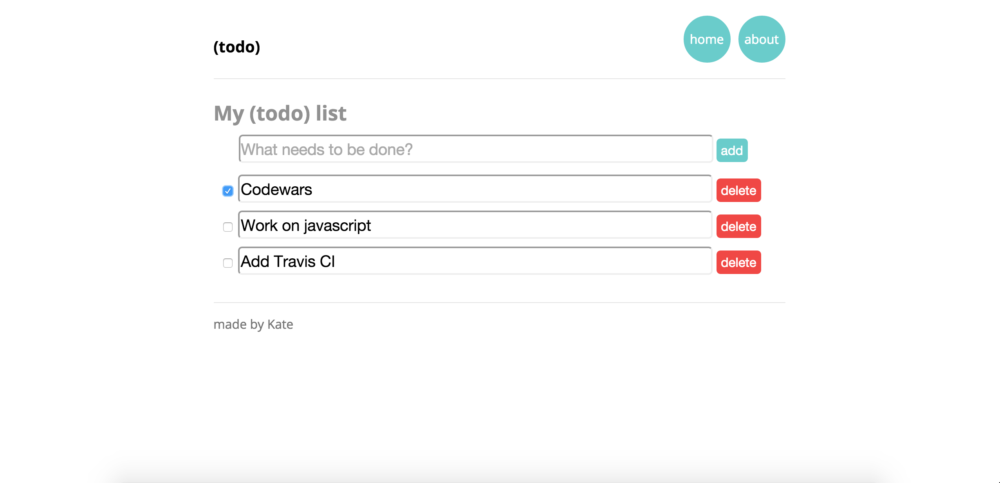

[](https://codeclimate.com/github/katebeavis/todo_challenge) [](https://travis-ci.org/katebeavis/todo_challenge)
# Todo Challenge

A todo list app that enables you to add and remove items to a list, featuring localstorage to ensure your list is not lost.

## Screenshots
<div align="center">
  
</div>

## Objectives

This challenge was to reinforce our knowledge of Angular and Karma testing.

## Technologies Used

- Angular JS
- Javascript
- Karma
- Yeoman Seed
- Grunt CLI
- HTML
- CSS

## To run

```
$ git clone https://github.com/katebeavis/todo_challenge
$ cd todo_challenge
$ bower install
$ npm install
$ grunt serve --force
visit localhost:9000
```
